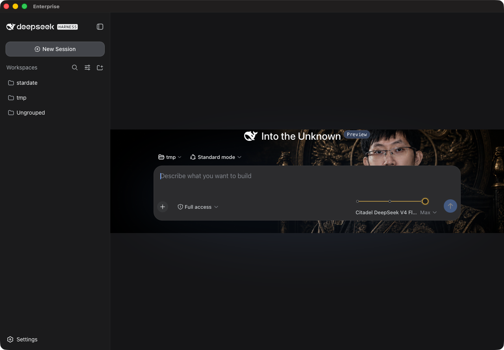

# DSH Shell

A native macOS shell (Swift + WKWebView) for the **DeepSeek Harness (DSH)** webapp. Wraps the DSH frontend at `http://127.0.0.1:3092/` in a proper Mac app with native tabs, native macOS chrome, and a reasoning-effort rail built into the composer.



## Features

- **Native tab bar** with user-named tabs and Liquid Glass styling (macOS 26+)
- **Reasoning effort rail** — Off / High / Max slider injected into the composer, wired to the model's reasoning-effort setting
- **Founder-morph theme** (v3.1) — the background persona transforms with effort level: suited figure in fog (Off) → mandarin-collar jacket (High) → black-and-gold imperial robe (Max), with a 620ms crossfade. Toggle in **View → Show Founder Morph** (⌘⇧F) or **Settings → Show founder morph**; applies live, persists across relaunch
- All injection is done via an audited user script (`Resources/EffortControl.js`) with a bounded DOM fixture test suite

## Install

1. Download `DSH-Shell-v3.1.dmg` from [Releases](../../releases)
2. Open the DMG and drag **DSH Shell** to `/Applications`
3. The app is ad-hoc signed (no Developer ID), so on first launch **right-click → Open** to pass Gatekeeper

**Requirement:** the DSH backend webapp must be running at `http://127.0.0.1:3092/`. The shell renders whatever that server serves.

## Build from source

```bash
git clone https://github.com/henrino3/dsh-shell.git
cd dsh-shell
./scripts/build-app.sh          # builds .build/DSH Shell.app
./scripts/ctrl-gate.sh          # full gate: syntax, build, plist, codesign, DOM fixture
open ".build/DSH Shell.app"
```

## Verification

`./scripts/ctrl-gate.sh` runs: JS syntax check → source plist → full build → bundle resource check → built plist → codesign verification → bounded DOM interaction fixture (Playwright). The gate must pass before any release.

## Version history

- **3.1.1** — fix: founder hero faces anchored per level (Off/High top-anchored, Max centered); effort-flake fix (retrying native effort apply); View → Show Founder Morph menu item (⌘⇧F)
- **3.1** — founder-morph theme + Settings toggle; fix: hero target resolves to the live composer stage (`.wSkVaW_composerSeat`) instead of a 266×56 control strip when no `<main>` landmark exists
- **3.0** — minimalist redesign: native tabs, user-named sessions, chrome folded into Settings
- **2.0** — effort dial (Off/High/Max) rail + founder hero
- **1.0** — initial checkpoint
